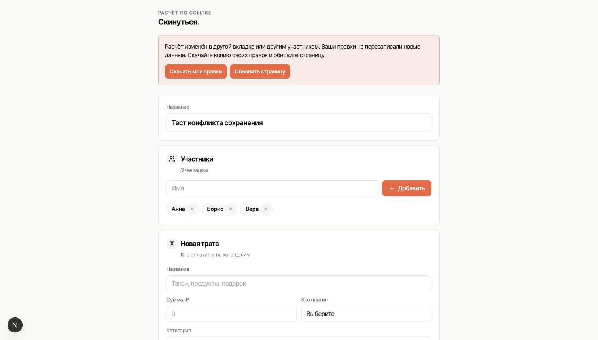

# Исправления сохранения и доступа — 02.10.2026

Подготовлены в `codex/fix-project-data-safety`, PR направляется в `dev`.

## Поведение

- Веб-калькулятор сохраняет расчёт только при совпадении `updated_at` с прочитанной версией. Запросы одной вкладки сериализованы; промежуточные ожидающие состояния объединяются. Устаревшее сохранение не заменяет текущие данные. При конфликте правки остаются на экране, доступно скачивание JSON-копии и обновление с подтверждением. При сетевой ошибке можно повторить сохранение.
- Синхронизация участников при открытии и пересчёт валют защищены условием версии. Фиксация курса при сохранении происходит в одной операции с payload. Изменение share/edit token и TTL не меняет версию содержимого.
- Передача владения блокирует строку проекта, проверяет владельца и обновляет `owner_id` вместе с ролями. Миграция исправляет уже переданные проекты с единственным текущим владельцем; проекты с несколькими владельцами требуют отдельной проверки.
- Кэш валют записывается только серверным service-role клиентом. `PUBLIC`, `anon`, `authenticated` больше не могут вызывать RPC записи. Старый кэш очищается; зафиксированные курсы проектов не меняются. Без `SUPABASE_SERVICE_ROLE_KEY` живые курсы работают, запись в кэш пропускается.
- Service worker v2 кэширует только публичную статику своего origin. Приватные HTML/RSC/API не кэшируются. Старые кэши приложения очищаются при активации новой версии; чужие кэши сохраняются. В офлайне приватные страницы возвращают сообщение об отсутствии сети.

## Выпуск

1. Проверить наличие `SUPABASE_SERVICE_ROLE_KEY` в Vercel (Production и Preview), не копировать его в клиентские переменные или Git.
2. Применить `supabase/migrations/20261002000001_project_data_safety.sql` через Supabase SQL Editor. Старая функция записи по edit-link перестаёт быть доступной: между применением миграции и новым деплоем старые анонимные вкладки не смогут сохранять. Выполнить эти шаги подряд в согласованное окно обновления.
3. Проверить preview PR: конфликт двух вкладок, сохранение по ссылке после claim, смену курса и передачу владельца. Использовать отдельные тестовые проекты.
4. Выпустить через `dev → main`, дождаться Ready в Vercel. Обновить открытые вкладки приложения; для PWA дождаться активации service worker v2.

Миграция проверена на изолированной PostgreSQL-базе PGlite с историческими миграциями проекта, RLS и ролями. Рабочая Supabase-база при подготовке исправлений не изменялась.

Мобильный клиент в соседнем репозитории не входит в этот PR: его прямые сохранения payload не проверяют версию. Для совместной работы веб + iOS нужна аналогичная защита в iOS. При выпуске обновить веб-вкладки; старые клиенты не получают новую очередь сохранения автоматически.

## Проверка

- `npm test`: очередь сохранений; устаревшие записи под RLS; анонимные/claimed/просроченные ссылки; восстановление предыдущих передач владения; удаление прежнего владельца; закрытие RPC от публичных ролей; повторное применение миграции; очистка приватного кэша и офлайн-поведение.
- `npm run lint`, `npx tsc --noEmit`, `npm run build`.
- Экран конфликта проверен локально с искусственным ответом сервера; новый участник остался в интерфейсе и скачанной JSON-копии. Тестовая заглушка находится только во временной копии, не в репозитории.

